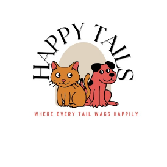

<div align="center">



# Happy Tails

### 🐾 A Dedicated Platform for Sharing Love & Finding Homes 🐾


</div>

---

## 📖 About The Project

**Happy Tails** is a comprehensive backend solution for pet adoption and pet care management. It bridges the gap between animals in need and loving families while providing tools for existing pet owners to manage their pets' health and milestones.

Unlike simple adoption sites, Happy Tails features a dual-system:

1.  **Public Adoption Marketplace:** For listing and finding adoptable pets.
2.  **Private Pet Management:** For users to track vaccinations, health stats, and medical records of their own pets.

---

## 🚀 Key Features

### 🏡 For Adopters & Shelters

- **Smart Matching:** Users can set `PetPreferences` to find compatible pets.
- **Adoption Workflow:** seamless process from `AdoptionRequests` -> `Interviewing` -> `Approved`.
- **In-App Messaging:** Direct communication between potential adopters and current caretakers.
- **Detailed Profiles:** `Adoptables` include behavior tags (House Trained, Kids Friendly) and medical status.

### 🩺 For Pet Owners

- **Health Tracking:** Log weight, height, and vital statistics in `PetHealthStats`.
- **Medical Vault:** Securely store medical records and prescriptions in `PetMedicalRecords`.
- **Vaccination Reminders:** Track `last_vaccine_date` and sterilization status.

### 🔐 Security & Architecture

- **Role-Based Access:** Distinction between Standard Users and Admins.
- **Secure Authentication:** Password hashing using **BcryptJS**.
- **Data Integrity:** Strict input validation using **Joi** before data hits the **MariaDB** database.

---

## 🛠️ Tech Stack

- **Runtime:** Node.js
- **Framework:** Express.js
- **Database:** MariaDB (Relational)
- **Architecture:** MVC (Model-View-Controller)
- **Validation:** Joi
- **Authentication:** JWT & BcryptJS

---

## 🗄️ Database Structure

The project uses a normalized MariaDB schema consisting of 9 core modules:

1.  **Users & Auth:** `Users`, `Addresses`, `UserProfiles`
2.  **Pet Data:** `PetTypes`, `PetBreeds`
3.  **Private Ownership:** `Pets` (Owned by users)
4.  **Adoption System:** `Adoptables` (Public listings), `AdoptableImages`
5.  **Operations:** `AdoptionRequests`, `Messages`
6.  **Health:** `PetMedicalRecords`, `PetHealthStats`
7.  **Compatibility:** `PetPreferences`, `CompatibilityTags`, `AdoptableCompatibility`

---

## ⚙️ Installation & Setup

Follow these steps to get the backend running locally.

### 1. Clone the Repository

```bash
git clone https://github.com/yourusername/happytails.git
cd happytails
```

### 2. Install Dependencies

```bash
npm install
```

a

### 3. Database Setup

Ensure you have **MariaDB** installed and running.

1.  Create the database: `CREATE DATABASE happytails;`
2.  Import the schema:
    ```bash
    mariadb -u root -p happytails < database/DatabaseCreation.sql
    ```

### 4. Configure Environment

Create a `.env` file in the root directory:

```env
PORT=3000
DB_HOST=localhost
DB_USER=root
DB_PASS=your_password
DB_NAME=happytails
JWT_SECRET=your_super_secret_key
```

### 5. Run the Server

```bash
# For development (using nodemon)
npm run dev

# For production
npm start
```

---

## 🛣️ API Roadmap

- [ ] **Auth:** Register, Login, Profile Management
- [ ] **Pets:** Add Pet, Update Health Records, Upload Images
- [ ] **Adoption:** List Adoptable, Search with Filters, Request Adoption
- [ ] **Admin:** Manage Lookup Tables (Breeds/Types), Ban Users

---

## 🤝 Contributingc

Contributions are what make the open source community such an amazing place to learn, inspire, and create. Any contributions you make are **greatly appreciated**.

1.  Fork the Project
2.  Create your Feature Branch (`git checkout -b feature/AmazingFeature`)
3.  Commit your Changes (`git commit -m 'Add some AmazingFeature'`)
4.  Push to the Branch (`git push origin feature/AmazingFeature`)
5.  Open a Pull Request

---

<div align="center">
    <p>Built with ❤️ for 🐶 & 🐱</p>
</div>
