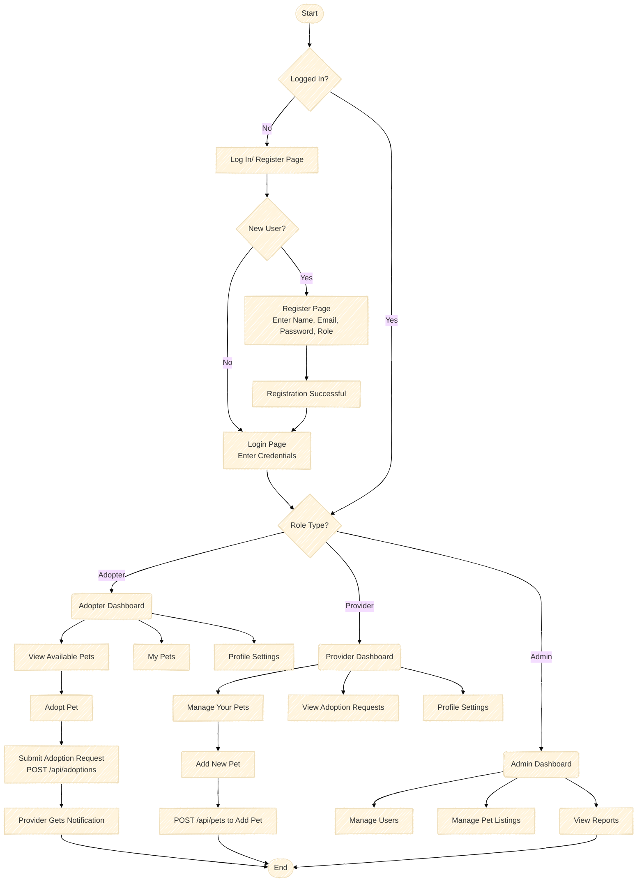

## 🐾 Pet Management Workflow

```mermaid
---
config:
  layout: dagre
  theme: base
  look: handDrawn
---
flowchart TD
    C{"New User?"} -- Yes --> D["Register Page<br>Enter Name, Email, Password, Role"]
    C -- No --> E["Login Page<br>Enter Credentials"]
    D --> F["Registration Successful"]
    F --> E
    E --> G{"Role Type?"}
    G -- Adopter --> H["Adopter Dashboard"]
    H --> H1["View Available Pets"] & H3["My Pets"] & H4["Profile Settings"]
    H2["Adopt Pet"] --> H5["Submit Adoption Request<br>POST /api/adoptions"]
    H5 --> H6["Provider Gets Notification"]
    G -- Provider --> I["Provider Dashboard"]
    I --> I2["Manage Your Pets"] & I3["View Adoption Requests"] & I4["Profile Settings"]
    I1["Add New Pet"] --> I5["POST /api/pets to Add Pet"]
    G -- Admin --> J["Admin Dashboard"]
    J --> J1["Manage Users"] & J2["Manage Pet Listings"] & J3["View Reports"]
    H6 --> K(["End"])
    I5 --> K
    J3 --> K
    I2 --> I1
    n1["Logged In?"] -- Yes --> G
    n1 -- No --> n2["Log In/ Register Page"]
    A(["Start"]) --> n1
    n2 --> C
    H1 --> H2
    H@{ shape: rounded}
    I@{ shape: rounded}
    J@{ shape: rounded}
    n1@{ shape: diam}
    n2@{ shape: rect}

```
