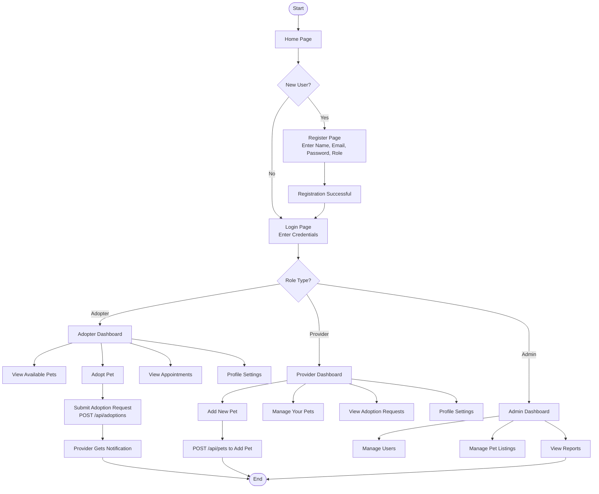

```mermaid
flowchart TD

%% ====== Start ======
A([Start]) --> B[Home Page]

%% ====== Home Page Decision ======
B --> C{New User?}

C -->|Yes| D[Register Page<br/>Enter Name, Email, Password, Role]
C -->|No| E[Login Page<br/>Enter Credentials]

%% ====== After Registration ======
D --> F[Registration Successful]
F --> E

%% ====== Login and Role Decision ======
E --> G{Role Type?}

%% ====== Adopter Flow ======
G -->|Adopter| H[Adopter Dashboard]
H --> H1[View Available Pets]
H --> H2[Adopt Pet]
H --> H3[View Appointments]
H --> H4[Profile Settings]
H2 --> H5[Submit Adoption Request<br/>POST /api/adoptions]
H5 --> H6[Provider Gets Notification]

%% ====== Provider Flow ======
G -->|Provider| I[Provider Dashboard]
I --> I1[Add New Pet]
I --> I2[Manage Your Pets]
I --> I3[View Adoption Requests]
I --> I4[Profile Settings]
I1 --> I5[POST /api/pets to Add Pet]

%% ====== Admin Flow ======
G -->|Admin| J[Admin Dashboard]
J --> J1[Manage Users]
J --> J2[Manage Pet Listings]
J --> J3[View Reports]

%% ====== End ======
H6 --> K([End])
I5 --> K
J3 --> K
```
